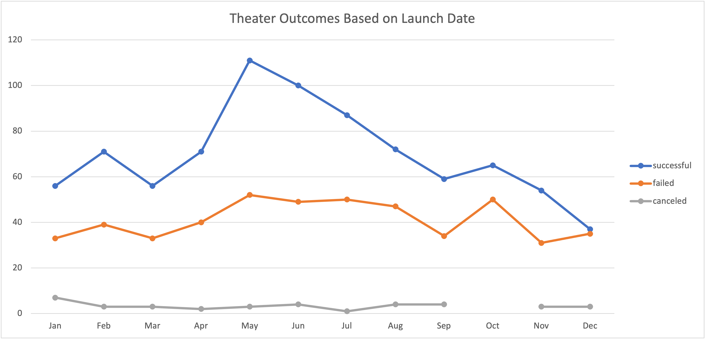
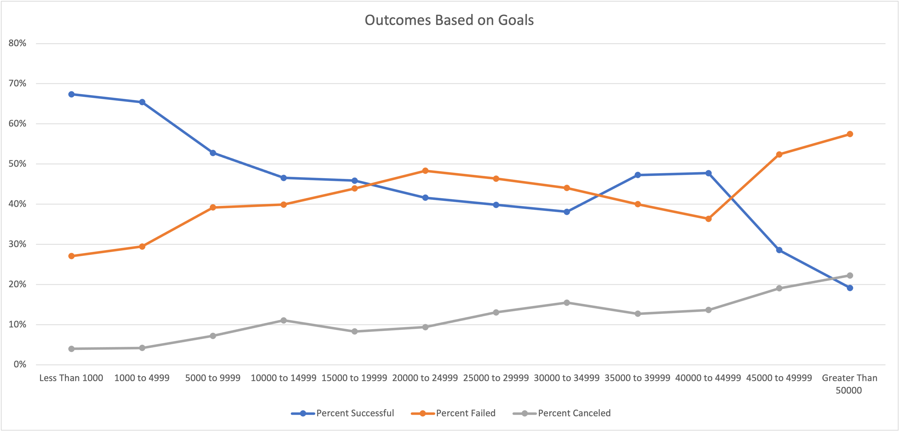

# Kickstarting with Excel

## Overview of Project
The purpose of this project was to deepen applicable knowledge of Excel-related skills, by analyzing  a sample dataset of Kickstarter campaign funding data. Skills included cleaning of data, running statistical analysis, creating pivot tables, and determining the existence and extremes of outliers.

### Purpose
With this sample dataset, the purpose was to specifically look at the outcomes of various campaigns based on their launch dates. As well as determine if the outcome of a campaign is drastically effected by the financial goal amount. This analysis will assist in determining when the optimal time, as well as goal amount, in order to have the likelihood of a successful campaign.

## Analysis and Challenges
From the dataset at large, the following analyses were done on the data. The Launch Date and Deadline Date needed to be changed from UNIX form to a usable, MMDDYYYY format. From there, Category and Subcategory needed to be broken out from a single cell to individual cells. Additional data points were created from the original data, in order to provide deeper context or additional data elements that didn't already exist. Such elements included, Percent Funded for each campaign, Average Pledge amount for each campaign, among others.

### Analysis of Outcomes Based on Launch Date
With the Launch Date in usable format, YEARS and DAYS were able to be calculated from Launch Date and Deadline Line for each campaign. The year at which the sample was launch was calculated, and then used as a main datapoint in a Pivot Table to display the number of campaigns and their associated outcomes at each month the campaign was launched. 

### Analysis of Outcomes Based on Goals
A table was created to count the number of campaigns that had various outcomes (successful, failed, canceled) based on their funding goals. These funding goals were done in increments of $5,000. A bar graph was then generated to look at the percent of campaigns in each outcome, based on their funding goal amounts. 

### Challenges and Difficulties Encountered
There weren't many challenges or difficulties encountered for this specific analysis. Mainly, just properly cleaning the data to make it more usable and understanding the most valuable ways to display the data in order to provide valuable insights.

## Results

- What are two conclusions you can draw about the Outcomes based on Launch Date?
For Theater campaigns, there appears to be greater success with campaigns reaching their funding goals during the months of May, followed by June and July. With the least successful month for campaigns occurring in December. Therefore, in order to have a greater chance of campaign(s) reaching funding goals, it is recommended to run campaigns in the month of May, or June and July. 

- What can you conclude about the Outcomes based on Goals?
Overall, campaigns the had smaller financial goals for their campaigns to reach were far more likely to succeed in reaching their goal. The ideal campaign goal that was most successful in reaching its goal, had a goal of $1,000 or less. Campaigns that had goals of $20,000 or more, were more likely to fail than succeed.

- What are some limitations of this dataset?
There was some extreme outliers in the goals and amount funded for some of the campaigns. This caused the data to be heavily skewed to the right. 

- What are some other possible tables and/or graphs that we could create?
Some other graphs that might be helpful would be the length of time the campaign was active and the outcome of the campaign. This can help in determining if a short campaign was more or less successful in reaching its pledge goal. Another helpful graph would be to look at how spotlighting a campaign can possible effect the outcome of the campaign, as well as the total amount a campaign raised. If spotlighting a campaign does increase success and/or increase total amount raised, then investing in a spotlight for a campaign might be worthwhile. 

Additional data, not in the current dataset, but extremely helpful to continue to determine the optimal indicators of campaign success would be pledger demographic data. By being able to tie demographics of pledgers to campaigns, it can be helpful in seeing if there are certain demographics that can contribute to greater campaign success. 

## Recommendations
It is recommended, that for Theater campaigns, and in general all other campaigns, to have a campaign goal of less than $5,000 and run campaigns during the month of May, and if necessary June and July. With this combination of campaign launch data and campaign goals, the campaign is most likely to succeed.
